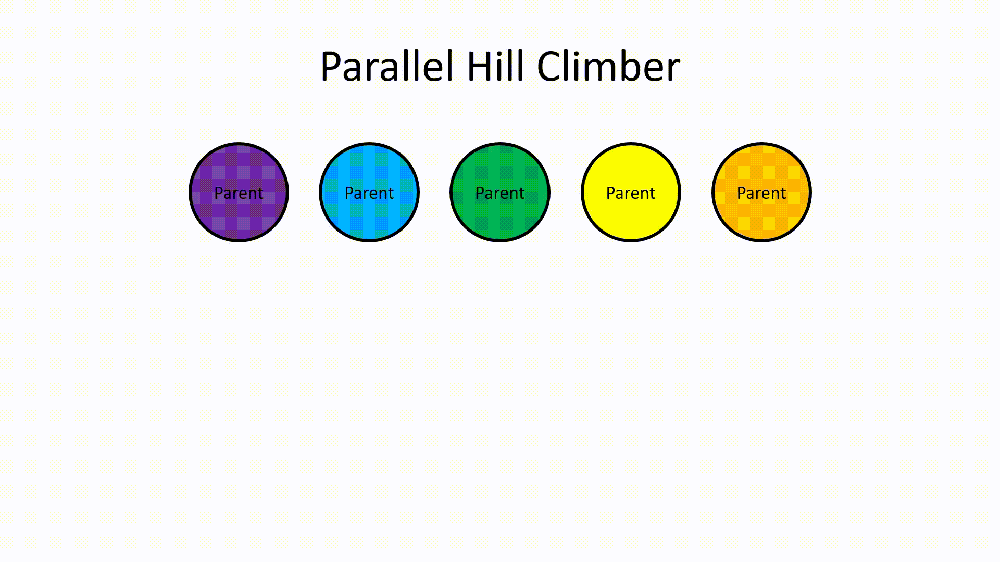
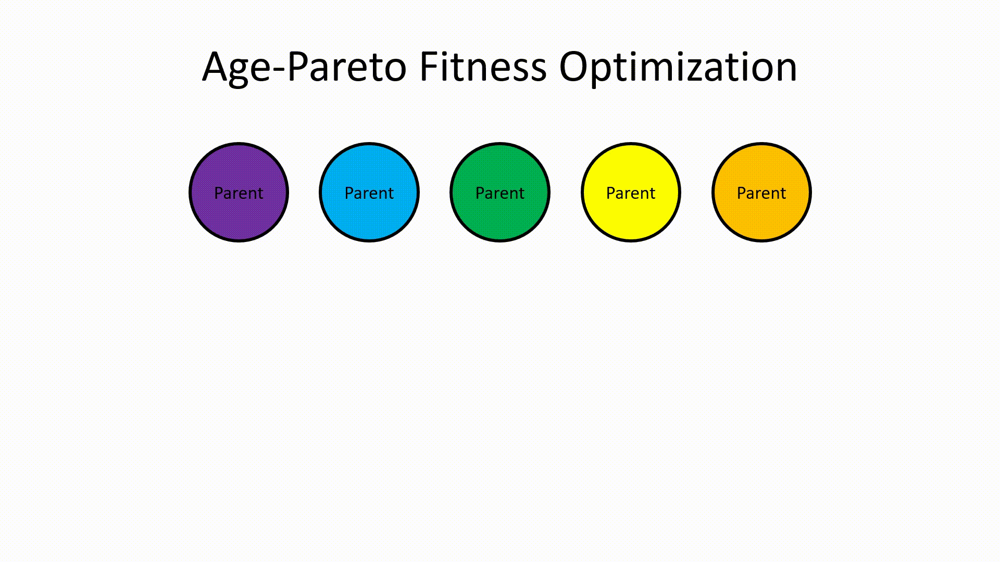
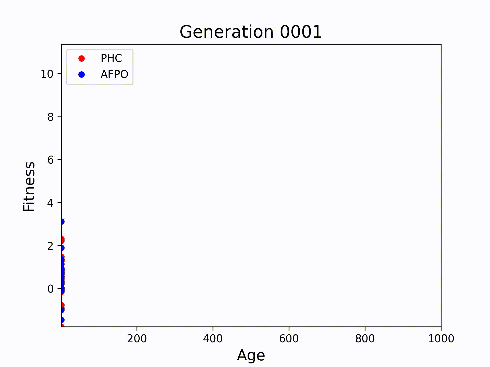

# Final Project for ME 495 Artificial Life, Winter 2023

## Summary
Here we explore the evolutionary optimization of 3-dimensional robots for locomotion. These robots have rigid and spherical body segments, sensors, and motors, and they can evolve to exhibit a variety of locomotion modes including what may be described as walking, jumping, galloping, or rolling.

## YouTube Video 
https://youtu.be/HZSNYF7xUm0

## Hypothesis
The performance of two evolutionary optimization algorithms, a parallel hill climber and an age-fitness Pareto optimization scheme, are compared.

I suspect that the age-fitness Pareto optimization algorithm will be able to find better designs than the parallel hill climber for a given simulation budget because the parallel hill climber has no mechanism to escape local optima that members of the population may settle into.

## Body Generation
Robots are initially generated randomly according to the following variable parameters.
- number of spherical body segments
- size of each body segment
- joint locations with respect to parent links
- joint axis directions
- sensation (green links "feel", blue links are "numb")
- maximum number of children per link constraint
- maximum depth of the link tree constraint

Here we limit ourselves to spherical body segments for the sake of simple collision detection during body generation. While the default simulation parameters will allow links to intersect as they move, ensuring that links do not initially intersect assures us that we can simulate these robots with global collision detection if we so choose.

**Number of links**, **maximum children per link**, and **maximum link tree depth** are randomly prescribed for each robot. **Link radius** is uniformly randomly selected for each link. **Joint locations** and **Joint axis directions** are uniformly randomly tried over the spherical link surfaces via some fun math (search spherically symmetric distributions to learn more!) until a collision-free structure is achieved. Link **sensation** occurs at a fixed probability over all the links.

### Body Initialization Procedure
1. Create the root link at a specified location.
2. Randomly choose an existing link that is eligible to have a child. Links can be disqualified from further parenthood if they have too many children or are too deep in the tree.
3. Propose a random joint (location and direction) and link (size and sensation) to stem from the chosen parent.
4. If spawning this new joint-link pair will create a collision with the floor or other links, go back to Step 2.
5. Accept the randomly generated joint-link pair.
6. Repeat from Step 2 until the number of links is satisfied.

## Genetic Representation
All of the information required to define a unique robot body is encoded in the 2-dimensional array stored in **SOLUTION.links**. Each row corresponds to a link and its parent joint. The columns correspond to the following features.

1. absolute x-location of link
2. absolute y-location of link
3. absolute z-location of link
4. diameter of link
5. link sensation
6. eligibilty to spawn a child link
7. layer number in the link tree
8. parent link ID
9. absolute x-location of joint
10. absolute y-location of joint
11. absolute z-location of joint
12. relative x-location of joint w.r.t. its parent link
13. relative y-location of joint w.r.t. its parent link
14. relative z-location of joint w.r.t. its parent link
15. absolute x-component of joint axis
16. absolute y-component of joint axis
17. absolute z-component of joint axis

It is noted that the absolute location of each link (columns 1-3) and the absolute location of each joint (columns 9-11) are determined by the other elements in the array, so these are not mutated directly and are recomputed as needed.

The brain of the robot (i.e., the function transforming sensor inputs to motor actuation) is encoded in the 2-dimensional array stored in **SOLUTION.weights**. These weights correspond to coefficients in a shallow but fully connected neural network between sensors and motors.

## Mutation
For the genetic algorithm, a variety of random mutations are permitted to occur according to a user-defined probability distribution. These include changes that primarily affect the "brain" or the "body". There are currently 9 supported modes of genetic mutation which are summarized below.

Brain Mutations
1. Change a synapse:   replace one element in the **SOLUTION.weights** array
2. Swap sensors:   swap two rows in the **SOLUTION.weights** array
3. Swap motors:   swap two columns in the **SOLUTION.weights** array
4. Add/remove a sensor:   insert/delete a row in the **SOLUTION.weights** array and modify **SOLUTION.links** accordingly

Body Mutations

5. Change joint axis:   replace elements 15-17 in one row of the **SOLUTION.links** array
6. Change link size:   replace element 4 in one row of the **SOLUTION.links** array
7. Change joint locations:   replace elements 12-14 in one row of the **SOLUTION.links** array
8. Add a link:   add a row to the **SOLUTION.links** array
9. Remove a link:   remove a row from the **SOLUTION.links** array

Genetic hyperparameters are adjustable, and it is noted that most of the robots shown in the YouTube video were initialized with few body segments and allowed to "grow" as they evolved. This harnesses the synergistic advantage of evolving behavior and body together, rather than starting with a large body and randomly (hopelessly?) searching a massive behavior space from scratch.

## Selection Algorithms
The implemented selection criteria is locomotion in the negative x-direction. In other words, the fitness of a robot is measured by the distance it travels into the screen. Two different schemes are used to select for this behavior.

### Parallel Hill Climber (PHC)
The parallel hill climber algorithm allows for arbitrary population sizes. Each parent robot within a population is copied and mutated to produce a child. Then, each parent competes with its own child and the fittest of the two is included in the population of the next generation. "Parallel" refers to the isolation of each lineage from the rest of the population. Performing 10 trials with a population size of 1 is equivalent to performing 1 trial with a population size of 10.

### Age-Fitness Pareto Optimization (AFPO)
The implemented age-fitness Pareto algorithm is an extension of the parallel hill-climber. Each parent still competes with its child for survival. However, to encourage exploration over exploitation, at the beginning of each generation the members of the population that are not on the age-fitness Pareto front are replaced with random initialized robots. Individuals are considered to be on the Pareto front if there is no other member in the population that has both a better age (younger) and fitness (moves further). This requirement for survival has the effect of killing off old phenotypes that have persisted through many generations if they have stagnated in improvement, which likely occurs because they have settled into a local optima of the design space. This frees up computational resources to try novel designs, which are likely to be worse at first but may have massive potential for improvement!

Additionally, a modification was made to protect individuals at the extreme ends of the spectrum. For the results presented, there are exceptions for individuals less than 3 generations old or in the top 20% of the population by fitness, allowing these individuals to persist even if they are not on the Pareto front.

## Discussion of Parallel Hill Climber vs. Age-Fitness Pareto Optimization
To test the hypothesis and determine whether or not AFPO will outperform PHC, otherwise identical evolution processes are run multiple times with new random seeds. The only difference between the AFPO and the PHC trials is the selection process. The body generation, mutation, and simulation hyperparameters are left unchanged.

First, evolution is performed with each selection algorithm for 5 different random seeds. The population size is 20, and the process spans 500 generations. These parameters correspond to 2x5x20x500 = 100,000 simulations. Plotted below is the maximum fitness over a population varying across generations. Suprisingly, the age-fitness Pareto algorithm did not clearly outperform the parallel hill climber, although it does appear more consistent. Both the best and worst final designs occured in different trials that used the parallel hill climber, while the final designs found by the Pareto algorithm were middle of the pack.

To elucidate why there is no apparent advantage to the Pareto selection algorithm, the members of populations are visualized in the age-fitness-generation space. To generate the video below, one trial of each selection algorithm is performed for 1000 generations with a population size of 20. These parameters correspond to 2x1x20x1000 = 40,000 simulations. We can see that for the Pareto algorithm, the majority of the population is replaced with random initializations very frequently. With the current evolution hyperparameters, there is not a lot of room on the Pareto front to simultaneously pursue many good designs. AFPO appears to commit too much to exploration, putting all of its eggs in the basket of only a few high-achieving robots.

## Future Work

I further hypothesize that the age-fitness Pareto optimization will outperform the parallel hill climber when the population sizes are smaller or when evolution is allowed to occur over more generations. Either of these hyperparameter changes should create more room on the Pareto front relative to the population size, which I suspect is required for the Pareto algorithm to signifigantly outperform the parallel hill climber. Due to limited time and computational resources, I have not yet seriously interogatted this suspicion.

## Run the code (Windows)

Ensure all of the files from this repository are present in your working directory (e.g., by cloning this repository or downloading it as a .zip file).

Run __Search.py__ to use a parallel hill climber to genetically optimize robots for locomotion in the negative x-direction.

- Simulation parameters, including maximum joint forces and angles, can be set in __constants.py__
- Random morphology generation parameters can be set in the constructor of the SOLUTION class defined in __solution.py__

__BestVisualize.py__ serves to easily visualize optimized creatures.
__PlotFitness.py__ will generate plots comparable to those seen above (after having previously run __search.py__).
__ShowRandom.py__ will generate and visualize a random robot.

If simulating with global collision detection, the "connect_factor" variable in __solution.py__ should be set slightly greater than 1 to ensure joint mobility. With a value of 1, the links are exactly touching without collision. The default value is 0.99 for aesthetic purposes, which is unproblematic for simulation without self-collision.

## References

Bongard, J. “Education in Evolutionary Robotics” Reddit, https://www.reddit.com/r/ludobots/.

Bongard, J. pyrosim GitHub repository, https://github.com/jbongard/pyrosim.

Coumans, E., Bai, Y., and Hsu, J. pybullet Python module for physics simulation

Kriegman, S. Artificial Life Course, Northwestern University, Evanston, Illinois, Winter 2023.

Schmidt, M., and Lipson H. “Age-Fitness Pareto Optimization.” Genetic Programming Theory and Practice VIII, 2010, pp. 129–146., https://doi.org/10.1007/978-1-4419-7747-2_8. 
